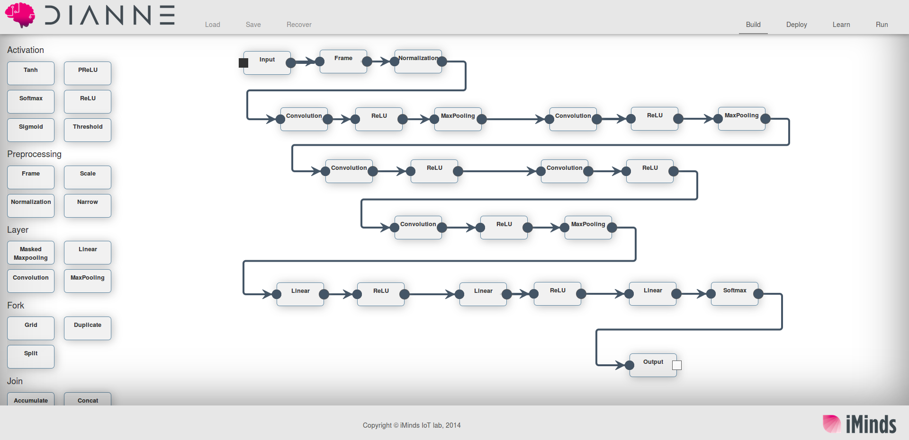

DIANNE overview
===============

Modules
-------

In DIANNE, the central entity is the **Module**. A Module is a basic building blocks of a neural network, which provides two flows of information: a forward pass and a backward pass. In the forward pass, required for neural network execution, the input data is transformed in some way to give an output. In the backward pass, required for training neural networks, the gradient on the output of the previous forward pass is taken in and the corresponding gradient on the input is calculated. Each module can have one (or more) next modules to forward its output to, and one (or more) previous modules to propagate the gradient on the input to.

A neural network can be constructed by chaining a number of modules. Starting with a special **Input** module, which simply forwards the input data, and ending with another special **Output** module, which collects the output. Besides the Input and the Output module, DIANNE supports a number of other types to build up neural networks. A **Linear** module calculates a weighted sum of the input and can be combined with an activation module (currently **Sigmoid**, **Tanh** and (Parameterized) Rectified Linear Units (**(P)ReLU**) modules are supported) to model a fully connected neural network layer. For classification, a **Softmax** module is added before the Output which converts the output to classification probabilities.  

Besides modules for fully connected neural networks, we provide **Convolution** and **MaxPooling** modules which are  frequently used in state-of-the-art convolutional neural networks. Various split and combine modules allow to create parallel paths in a neural network. These special split and combine modules are the only modules which can have multiple next and previous modules. Finally, a number of preprocessing modules are provided, for example to normalize the input samples. By combining these modules one can build popular neural networks, such as for example the [Overfeat neural network](http://cilvr.nyu.edu/doku.php?id=software:overfeat:start):

In DIANNE, the Module is not only a functional block, but also a unit of deployment. This means that each individual module can be deployed on any device in a distributed computing environment. This allows fine grained distribution of neural network modules, enabling offloading parts of a neural network in case of small and embedded devices, or model-parallellism when training large neural network models.

Tensors
-------

The parameters and return values of the module's forward and backward passes are Tensors. DIANNE provides its own Tensor API providing various operations on n-dimensional arrays. Different implementations are available: one pure Java implementation, one based on the [Torch 7 Tensor library](https://github.com/torch/TH), and a Cuda implementation.

Runtime
-------

The DIANNE runtime runs on top of AIOLOS and OSGi in order to provide runtime modularity and distributed deployment. On each device running the DIANNE stack any neural network module can be deployed. At runtime, all next and previous modules of the neural network are wired together and a processing pipeline is constructed. When two modules are deployed on different devices, they will communicate via the remote procedure call mechanism offered by AIOLOS. 

Repository
----------

The DIANNE repository contains a collection of configured neural networks, as well as a collection of trained weights for these neural networks. Neural networks are stored in a file called modules.txt in JSON format, containing a map of all modules with their configuration parameters. Besides the modules descriptions, a layout.txt can provide information of the neural network layout in the GUI builder. Trained weights of a module are saved in a binary format. 

When a training procedure is started, newly trained weights will be stored into the repository. This way, the DIANNE repository can also be used as parameter server for parallel training on multiple devices. 

Datasets
--------

In order to train and evaluate your neural network, DIANNE provides a Dataset interface that offers input samples and corresponding outputs for supervised learning. DIANNE has built-in adapters for various 2D image datasets, such as MNIST, ImageNet, CIFAR-10/100 and STL-10.

UI
--

DIANNE comes with a web-based UI to build, deploy, train and evaluate a neural network. During the build phase modules can be drag-and-dropped onto the canvas to create a neural network. Next, each module can be deployed individually to a DIANNE runtime. Once deployed, one can attach a Dataset to train and/or evaluate the neural network. In the run tab, one can connect actual sensor devices (i.e. a camera) to the neural network Input module and visualize the output.

Besides the graphical user interface, DIANNE can also be controlled via a command line interface, or programmatically via the various APIs.
 
Training
--------

At the moment DIANNE only has a basic Stochastic Gradient Descent training algorithm implemented, using mean square error or negative log likelihood as optimization criterion, and with configurable momentum and regularization parameters. In the future also other training strategies will be supported. The training procedures can also be started via a JSON RPC interface.

Reinforcement Learning
----------------------

DIANNE also has basic support for deep Q learning, using temporal difference learning. DIANNE comes with a basic reinforcement learning agent, as well as interfaces for implementing an environment and experience pools. 

  