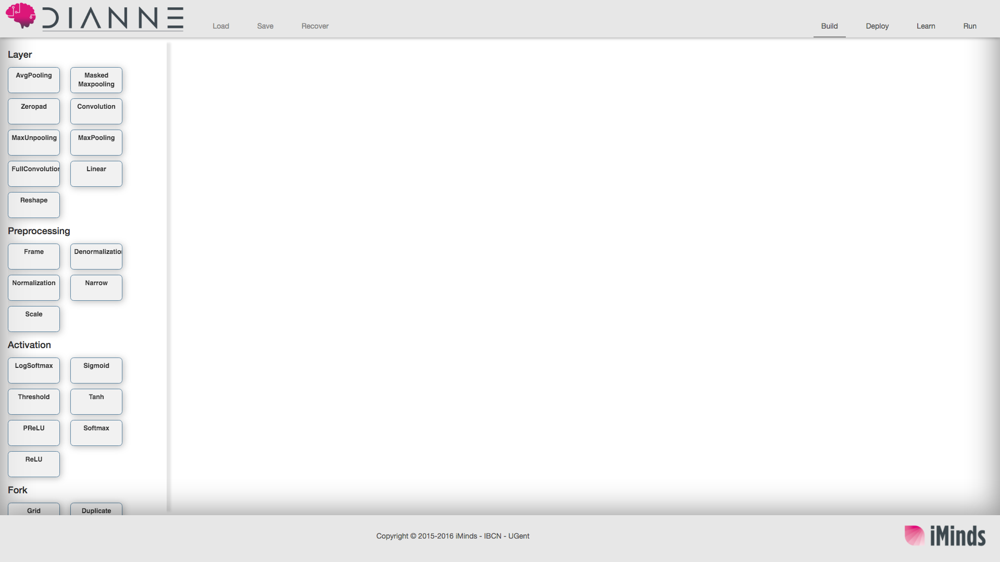
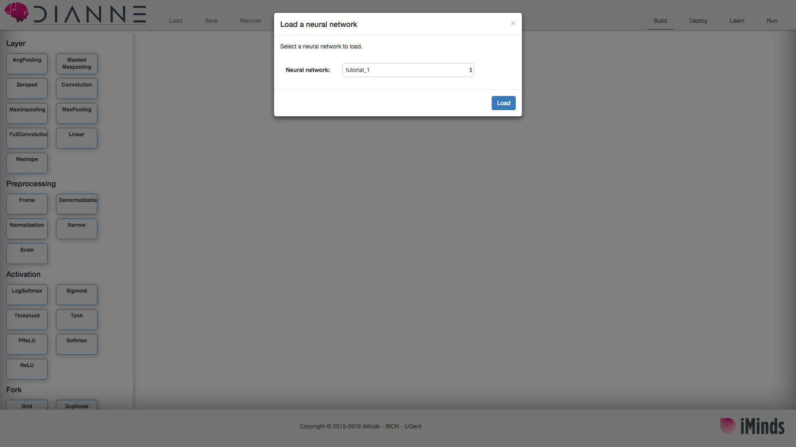
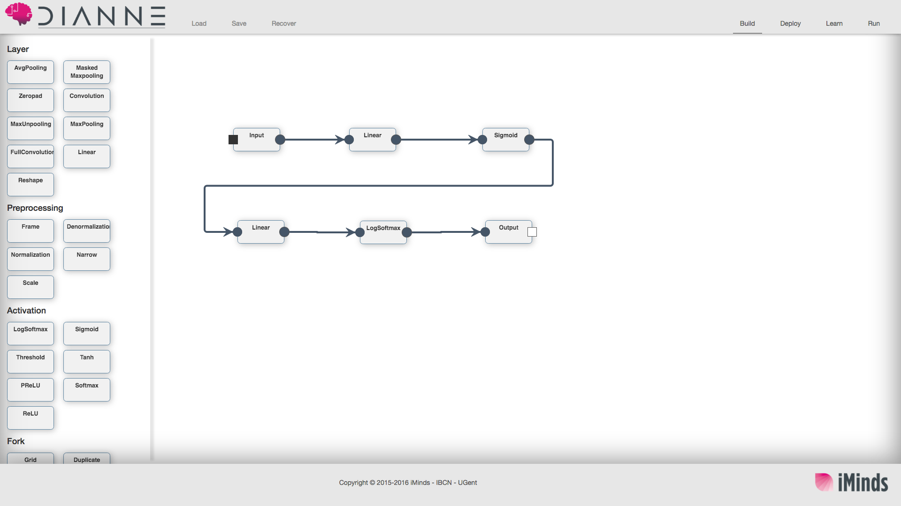
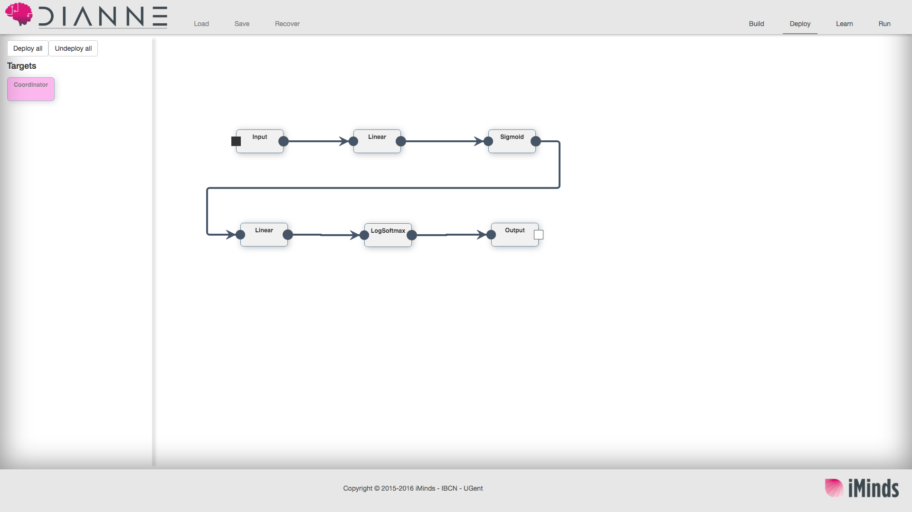
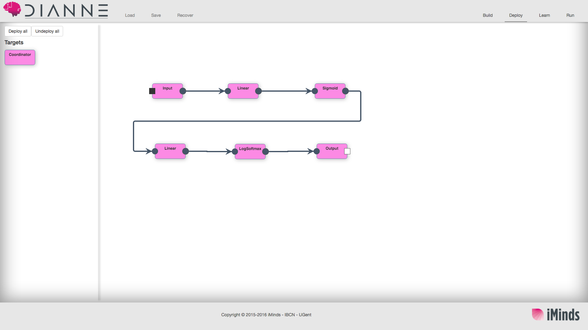
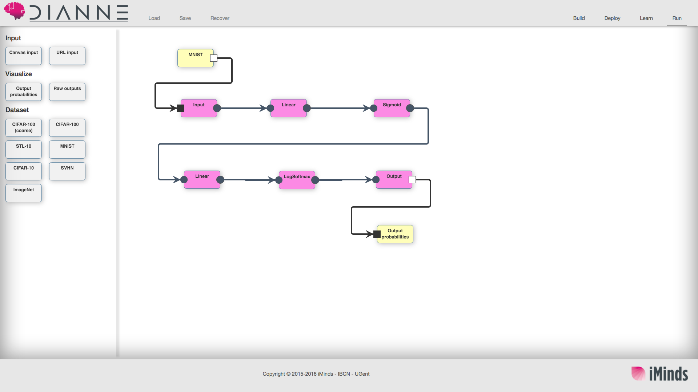
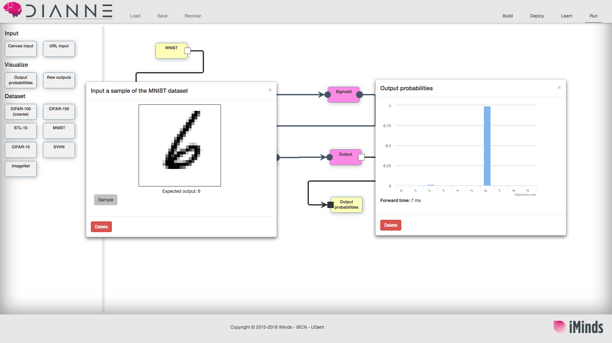

Getting started
===============

Prerequisites
---------------

We currently only support running (and building) DIANNE on Unix-based platforms, i.e. Linux & macOS, as we only have native code builds working for those platforms. Windows is currently not supported. In order to run DIANNE, you strictly speaking only require the following:

- Java JRE (minimum version **1.8**)
- gfortran3

If you want to use the GPU backend however, you also require:

- [CUDA runtime](https://developer.nvidia.com/cuda-zone) (minimum version **6.5**)
- CUDA-enabled GPU (minimum compute capability **2.0**)

The web UI is tested with the latest Firefox and Chrome browsers. 

Build yourself (recommended)
----------------------------

In order to provide optimal performance, we recommend building DIANNE from scratch on your own system. This allows [OpenBLAS](http://www.openblas.net/) to optimize its compilation for your specific architecture. In order to build and run DIANNE the following additional packages are required:

- Java JDK (minimum version **1.8**), i.e. [Oracle JDK](http://www.oracle.com/technetwork/java/javase/downloads/index.html) 
or [OpenJDK](http://openjdk.java.net/)
- [GNU GCC](https://gcc.gnu.org/)
- [GNU Make](https://www.gnu.org/software/make/)
- [CMake](https://cmake.org/)
- [Git](http://git-scm.com/)

While the DIANNE build system is based on [Gradle](http://gradle.org/), the correct version will be downloaded automatically when using `gradlew`, so this is recommended. If you want to build the GPU backend, you will also need the [CUDA Toolkit](https://developer.nvidia.com/cuda-zone) (minimum version **6.5**).

To start building, first clone the repository from GitHub:

	git clone https://github.com/ibcn-cloudlet/dianne.git

Next, it is recommended to check out the latest release and initialize the submodules. At the time of this writing, this is version v0.4.0. Note that in order to avoid any issues, it is recommended to initialize the submodules *after* you checked out the correct version.

	cd dianne
	git checkout v0.4.0
	git submodule init
	git submodule update
	
**Note about releases**: DIANNE releases are by no means bug-free but are rather local minima in the number of issues & feature requests.
If you have any problems building or running DIANNE, please use the [issue tracker on GitHub](https://github.com/ibcn-cloudlet/dianne/issues). If you are feeling experimental, feel free to check out the latest developments on the `master` branch!

If you run `./gradlew tasks`, you will get a listing of all the build targets along with their description. Then, in order to start the build, simply run:

	./gradlew build

By default, the CPU backend (torch) will be used. If you want to build the GPU backend (cutorch), use:

	NATIVE=cutorch ./gradlew build

Now would be a good time to get some coffee, as this may take a while.

**Note for macOS**: As the default macOS compiler, `clang`, does not support OpenMP but is aliased as `gcc`, you need to explicitly set the compiler version in order for the build to succeed. 
We recommend installing GNU GCC using [Homebrew](http://brew.sh/):
	
	brew install gcc --without-multilib

Then build using:
	
	CC=gcc-6 CXX=g++-6 ./gradlew build

If the build succeeds, you can either assemble any of the available run configurations to an executable `jar` file by running e.g.:

	./gradlew export.all
	
The different run configurations contain different subsets of the DIANNE platform services features, allowing you to deploy different runtimes on different machines according to your needs. If you want a single runtime with all the features, just use the `all` configuration. After assembly, the binaries will be available in `tools/generated/distributions/executable/`. Simply run them from the `tools` directory by executing e.g.:

	cd tools/
	java -jar generated/distributions/executable/all.jar

Another option is to directly launch DIANNE using the build tool by executing:

	./gradlew run.all
	
Using precompiled binaries
------------------------

A number of different precompiled binaries are available on the DIANNE [downloads page](http://dianne.intec.ugent.be/downloads/). Currently, only binaries for Linux are provided. Simply run these by executing e.g.:

	java -jar be.iminds.iot.dianne.all-torch-0.4.0.jar

**Note**: These binaries are assembled automatically and provided as is, there is no guarantee these will work flawlessly (let alone optimally) on all systems.

Deploy your first neural network
----------------------------------

Once you have DIANNE up and running, it's a good idea to check if everything is working accordingly by deploying a model and evaluating it on some data. The easiest way to do this is by downloading a preconfigured dataset & neural network model using the `gradle` tool:

	./gradlew datasets -Pwhich=MNIST
	./gradlew models -Pwhich=tutorial_1
	
This will download the MNIST dataset along with the necessary configuration file (for more information on datasets and adapters in DIANNE, see the [documentation on GitHub](https://github.com/ibcn-cloudlet/dianne/blob/v0.4.0/doc/datasets.md)), as well as a simple MLP model structure and trained weights.

Once the DIANNE runtime is started, direct your browser to:

	http://localhost:8080/dianne
		
The DIANNE web UI should show up:

We will now load the example model we just downloaded by clicking the `Load` menu item. Choose the `tutorial_1` neural network and hit the `Load` button in the dialog.

Now a simple fully connected neural network with one hidden layer and sigmoid activation function is shown.

To deploy this neural network, go to the deploy mode by clicking the `Deploy` menu item top right. Now, instead of neural network building blocks, you will see all connected DIANNE runtimes.

Right now this is only one, your local environment, which in his case is called `Coordinator`. To deploy the neural network modules, click on the `Coordinator` runtime box, and next click `Deploy All`. You can also click the `Coordinator` runtime box, and then click on each of the modules separately. 

Congratulations, you have just deployed your first neural network on DIANNE!

Now to see this neural network in action, click the `Run` menu item in the top right. You can skip the `Learn` tab for now since we already trained this neural network for you and we are just checking if everything works OK. In the `Run` tab, drag the `MNIST` dataset on the canvas and connect it to the `Input` module. Similarly select an `Output probabilities` block and connect the `Output` module to it:

Now you are set to forward your first sample through the neural network. Double click on both the `MNIST` module and `Output probabilities` blocks you added to the canvas. Two dialogs will pop up. Click the `Sample` button to randomly select a sample of the dataset and forward it through the network. The output probabilities should be visualized in the other dialog.

You can now go ahead and build and train your own neural network. To clear the canvas, just refresh the browser.
